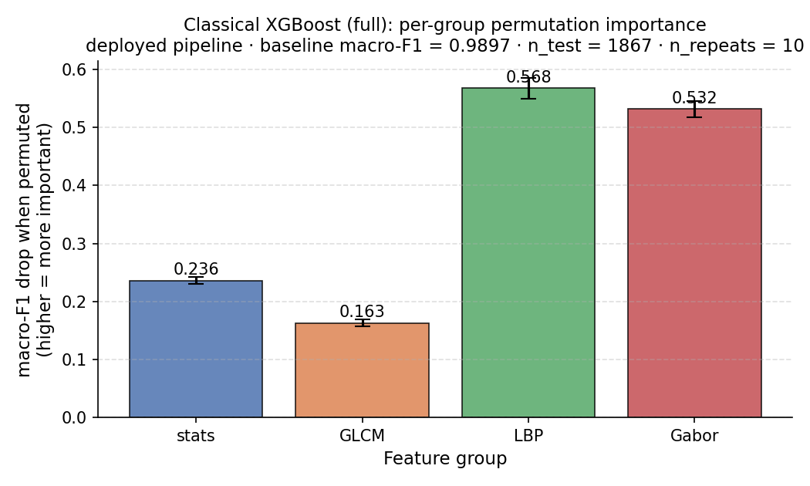
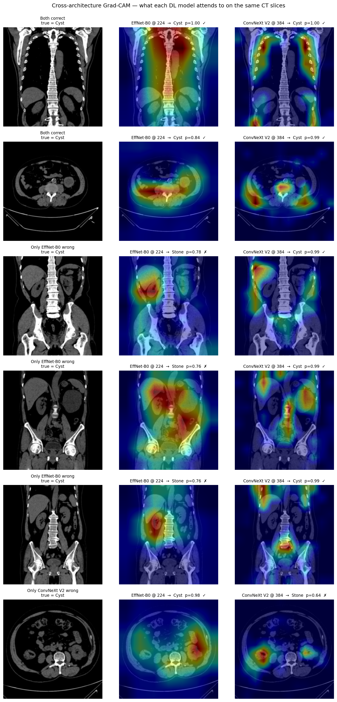
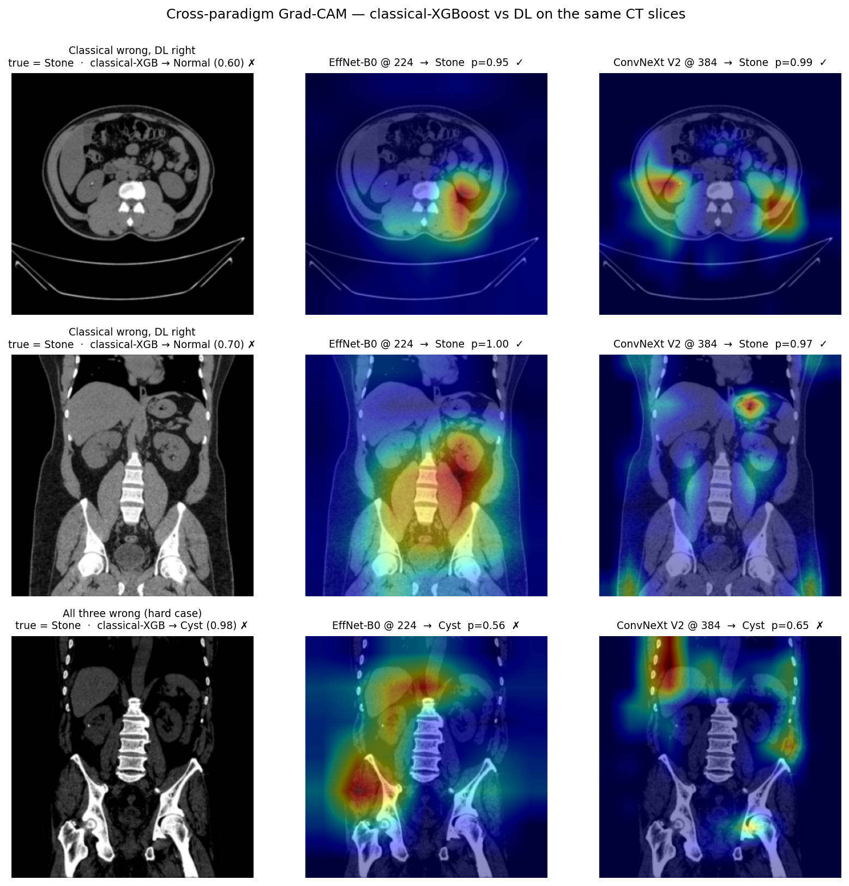

# Tutor Meeting Brief

**For:** BMET5933 Assignment 2 tutor meeting, Wednesday 2026-04-29
**Team:** Person A (classical ML, XGBoost) + Person B (deep learning, EfficientNet-B0 + ConvNeXt V2)
**Goal of meeting:** validate the reframed thesis, get directional feedback on framing and limitations, and surface anything Sandhya wants us to adjust **before** drafting the paper.

Read [[Project_Framing_v2]] before the meeting for full context.

> **Sprint 3 update (2026-04-27).** Classical XGBoost retrained on the full 12,446-image split (8,712 train, 1,867 test); now matched-test-set against EffNet-B0-full and ConvNeXt V2-full. Macro-F1 = 0.9897 (13 errors). **The medium-set "disjoint errors / 100 % ensemble" finding does not replicate at full scale** — classical and ConvNeXt V2 share 2 errors, classical and EffNet share 4, all `Stone→Cyst`. Paired McNemar's classical-vs-each-DL is no longer significant (p = 0.089 / 0.119).
>
> **Same-day addendum (RF + SVM also re-fit on full):** the surviving narrow Sprint 3 claim — "only DL makes `Cyst→Stone` errors" — *also* fails once RF and SVM are added: RF makes 2 `Cyst→Stone` errors (within range of ConvNeXt V2's 3), so the zero-`Cyst→Stone` is XGBoost-specific, not paradigm-specific. The performance ranking at full scale is **`ConvNeXt V2 (6 err) > XGB (13) > EffNet (23) ~ RF (27) >> SVM (238)`** — classifier choice within a paradigm dominates the paradigm split.
>
> **Day-2 update (2026-04-28, interpretability + 3-way disagreement check).** Two additions: (1) classical XGBoost feature importance shows LBP (54 % macro-F1 drop when permuted) and Gabor (53 %) jointly dominate, with stats and GLCM contributing far less — the dataset is solvable by *multi-scale local-pattern + frequency-response* features, more specific than the previous "texture-solvable" hand-wave. (2) The 3-way disagreement bucket counter reveals **a *fourth* invalidation step**: `classical_right_dl_wrong = 0` — *no test image (out of 1,867)* exists where classical-XGB uniquely succeeds over both DL backbones. The Sprint 1 "complementary signal between paradigms" claim is now formally falsified at full scale. Cross-paradigm Grad-CAM (Figure 3) shows DL backbones correctly attending to small focal calcifications (Stone) that classical's whole-image texture aggregation misses — mechanistic explanation for the 8 `Stone→Normal/Cyst` classical-only errors. Q1 (dataset-saturation framing) is now **quadruply** load-bearing. See [[experiments/Sprint3_classical_on_full]] §"Sprint 3 second addendum".
>
> **Day-3 update (2026-04-29, post-tutor overfitting diagnostics).** Sandhya raised the overfitting hypothesis at the Wednesday meeting; we ran four targeted diagnostics. **The classical-overfit framing is rejected by all four**: XGB train+val curves saturate together (no widening gap; deployed n=200 is within 0.0002 macro-F1 of val-best at n=399); both DL backbones show no val-loss rebound and were still climbing at the last epoch (under-trained, not over-trained); per-class CV variance is small (std ≤ 0.0023). **However, per-class CV reveals the strongest leakage signal so far**: held-out test Stone F1 (0.9703) is **3.9 σ below** the train+val 5-fold CV mean (0.9792 ± 0.0023), and Tumor is 2.2 σ above CV mean — the per-class structural mismatch between train+val and test that random stratification cannot smooth out, exactly what patient-level grouping would predict. The patient-leakage caveat moves from "literature-backed worry" to "dataset-specific observed signal" with quantitative evidence. See [[experiments/Sprint3_classical_on_full]] §"Sprint 3 third addendum".

---

## 1. The reframed thesis (one paragraph, slightly compressed for verbal delivery)

> We compared a classical machine-learning pipeline (handcrafted texture features + XGBoost) with two transfer-learned CNNs (EfficientNet-B0 and ConvNeXt V2 Base) on the Islam et al. 2022 kidney CT dataset, at two dataset scales (n=934 medium test set and n=1,867 full test set). All competent models achieve near-ceiling performance, and the medium-scale equal-weight soft-vote ensemble reaches 100 % accuracy. However, the main finding is not the score: it is that the clean medium-set interpretation collapses under stronger analysis. The original "disjoint errors / complementary paradigms" claim fails at full scale; the narrower XGB-only claim that only DL makes `Cyst→Stone` errors fails after adding RF and SVM; and the 3-way bucket check shows no full-set image where classical-XGB uniquely rescues both DL backbones. We argue that this four-step invalidation chain is the paper's most rigorous contribution: on saturated medical-imaging benchmarks, paradigm-level claims are easy to overclaim and require multi-scale, multi-classifier, bucket-level verification before being reported.

---

## 2. Three key findings (numbered, with caveats)

### Finding 1: paradigm-level claims are scale- and classifier-dependent

**At medium scale (n=934 test):** classical = 0.998 acc, EffNet-B0 + TTA = 0.986 acc, equal-weight ensemble = 1.000 acc. Errors are disjoint (both-wrong = 0). Classical fails on Cyst↔Tumor; DL fails on Cyst↔Stone.

**At full scale (n=1867 test, all three pipelines on the same test set):** classical-XGB-full = 0.993 acc / 0.9897 macro-F1, EffNet-B0-full = 0.988 acc, ConvNeXt V2-full = 0.997 acc. **Disjoint-error claim does NOT survive**: classical ∩ ConvNeXt V2 = 2 both-wrong (Stone→Cyst); classical ∩ EffNet-B0 = 4 both-wrong (Stone→Cyst). Paired McNemar's classical-vs-each-DL: p = 0.089 (vs EffNet) and 0.119 (vs ConvNeXt) — not significant. Sprint-2 result EffNet-vs-ConvNeXt-V2 reproduces (p = 0.0021).

**Originally claimed narrower asymmetry at full scale (XGB-only Sprint 3):** *"only DL pipelines make `Cyst→Stone` errors (9 EffNet + 3 ConvNeXt vs 0 classical)"*. **This claim is invalidated by the same-day addendum**: classical RF refit on full also makes 2 `Cyst→Stone` errors (within range of ConvNeXt V2's 3). The zero-`Cyst→Stone` result is **XGBoost-specific**, not paradigm-specific. The narrower asymmetry does not survive RF + SVM scrutiny.

**Caveat 1:** the dataset is saturated. Three other groups have approached 99 %+ on it (Islam Swin 99.30 %, Bingol 2023 hybrid 99.37 %, Teke 2025 GLCM-only 99.98 % on a related kidney-CT task). The 100 % ensemble figure is real on the medium subset but is a medium-scale artefact.

**Caveat 2 (Sprint 3-specific):** invalidating the "disjoint errors" claim by going from medium to full data is itself the paper's most defensible contribution if presented honestly. We will not bury this — we will lead with the two-scale comparison.

### Finding 2: architecture > data volume for EfficientNet-B0; classical wins shrink at scale (refreshed 2026-04-27)

**DL leg (unchanged from Sprint 2):** EffNet-B0 trained on full dataset (8,712 train) vs medium (4,353 train) — doubling the data moves error rate from 1.29 % (medium + TTA) to 1.23 % (full), essentially nothing. ConvNeXt V2 on the same full training reduces error rate to 0.32 % — 74 % reduction at matched data, *p* = 0.0021.

**Classical leg (new from Sprint 3):** classical XGBoost trained on full (8,712 train) vs medium (4,353 train) — error rate 0.21 % (2/934) on medium-test → 0.70 % (13/1867) on full-test. Test sets differ so this is directional, **but** the matched-test-set comparison at full scale shows classical's lead over the DL backbones is no longer statistically significant (McNemar p = 0.089 / 0.119). On medium, classical was clearly best; on full, it is statistically tied with both DL backbones. Classical's advantage is dataset-scale-dependent.

**Sample efficiency (sweep on full)**: classical reaches 0.96 macro-F1 with only 871 training samples (10 % of full). For reference, EfficientNet-B0-baseline at 4,353 medium-train samples = 0.97. Handcrafted features get to near-asymptote with substantially less data — consistent with the radiomics-vs-DL data-efficiency literature (Lambin 2017; Guiot 2021).

**Caveat 2:** test sets aren't comparable sample-for-sample (medium-test ≠ full-test), so the cross-scale "classical 0.21 % → 0.70 %" reads as directional. The paired McNemar's at full scale (classical-vs-EffNet-full, classical-vs-ConvNeXt-full, EffNet-full-vs-ConvNeXt-full) **all use the same 1,867 test set** and are valid.

### Finding 3: interpretability — feature importance + cross-paradigm Grad-CAM (refreshed 2026-04-28)

**Classical XGBoost feature importance** (deployed pipeline, permutation on n=1867 test set):

- LBP: macro-F1 drop = **0.568** (multi-scale local binary patterns dominate)
- Gabor: 0.532 (frequency × orientation responses)
- stats: 0.236
- GLCM: 0.163

The dataset is solvable by *multi-scale local-pattern + frequency-response* features, more specific than the previous "texture-solvable" hand-wave. The top 5 individual features are 4 Gabor std-of-magnitude features at orientations π/2 (vertical) and 3π/4 (anti-diagonal), plus one LBP at the largest scale (P=24, R=3). Raw-XGB without PCA actually scores higher (macro-F1 0.9950 vs deployed 0.9897), and its top-importance features shift toward LBP+GLCM — providing a mechanistic explanation for why XGB and RF disagree on errors at full scale (PCA reshapes the feature weighting; RF doesn't use PCA).

**Cross-architecture Grad-CAM** (Sprint 2): EffNet-B0's attention is dispersed and frequently extends beyond the kidney silhouette; ConvNeXt V2's attention is consistently localised to kidney tissue. On the three `Cyst → Stone` errors unique to EfficientNet-B0, the smaller network peaks off-organ; ConvNeXt V2 fixates on the lesion and gets it right.

**Cross-paradigm Grad-CAM** (Sprint 3 second addendum, new): on the 8 `Stone → Normal/Cyst` slices that classical misclassifies but DL gets right, both DL backbones correctly attend to small focal high-density regions (visible bright calcifications); ConvNeXt V2's attention is sharper than EffNet-B0's. **Classical's whole-image LBP+Gabor aggregation cannot localise focal lesions** — the calcification occupies a small fraction of the 256×256 frame and gets averaged out. In these disagreement cases, DL localises focal calcifications that the classical whole-image aggregation misses.

**Caveat 3:** Grad-CAM is a local linear approximation of attribution and not a complete explanation of the model's decision process; the qualitative observation is suggestive of representational difference, not proof. We cite Selvaraju et al. (2017) and the Adebayo et al. (2018) sanity-check paper as the appropriate guardrails.

---

## 3. Feature importance and Grad-CAM figures

### Classical XGBoost feature importance

Deployed full-scale classical pipeline: `StandardScaler → PCA(50) → XGBoost`, permutation importance on the n=1,867 full test set, n_repeats=10.

| Feature group | Macro-F1 drop when permuted | Interpretation |
|---|---:|---|
| LBP | **0.568 ± 0.018** | strongest signal; multi-scale local binary texture |
| Gabor | **0.532 ± 0.014** | second strongest; frequency and orientation response |
| Intensity stats | 0.236 ± 0.006 | useful but not dominant |
| GLCM | 0.163 ± 0.006 | contributes, but less than expected |

Top individual features by deployed-pipeline permutation importance:

| Rank | Feature | Group | Macro-F1 drop |
|---:|---|---|---:|
| 1 | `gabor:f0.1_tpi/2_std` | Gabor | 0.0484 |
| 2 | `gabor:f0.4_t3pi/4_std` | Gabor | 0.0427 |
| 3 | `gabor:f0.4_tpi/2_std` | Gabor | 0.0319 |
| 4 | `lbp:P24R3_b1` | LBP | 0.0302 |
| 5 | `gabor:f0.2_t3pi/4_std` | Gabor | 0.0299 |

Raw-XGB without PCA scores higher than the deployed PCA pipeline: macro-F1 **0.9950** vs **0.9897**. This suggests PCA(50) slightly suppresses useful feature structure and helps explain why RF and XGB disagree despite sharing the same handcrafted feature family.

### Grad-CAM figures

Cross-architecture Grad-CAM compares EfficientNet-B0 and ConvNeXt V2 on the same full-set images. The main visual finding is that EfficientNet-B0 attention is more dispersed, while ConvNeXt V2 attention is more kidney-localised.

Cross-paradigm Grad-CAM focuses on cases where classical-XGB is wrong but both DL backbones are correct. The main visual finding is that the DL models attend to small high-density calcifications that whole-image LBP/Gabor aggregation can miss.

---

## 4. Three specific questions for the tutor

### Q1. Is the dataset-saturation framing defensible for an ISBI-style paper? *(four-step invalidation chain)*
We have a **four-step invalidation chain** to present:

- **Medium-set (Sprint 1)**: classical+DL ensemble → 100 % test accuracy on n=934. Disjoint errors (both-wrong = 0). Classical fails on Cyst↔Tumor; DL fails on Cyst↔Stone.
- **Full-set, XGB only (Sprint 3)**: 100 % ensemble does *not* replicate. Classical and ConvNeXt V2 share 2 `Stone→Cyst` errors; classical-vs-each-DL McNemar p > 0.05. Surviving narrower claim: "only DL makes `Cyst→Stone` errors".
- **Full-set, all classifiers (Sprint 3 addendum)**: surviving narrower claim *also* fails. RF makes 2 `Cyst→Stone` errors (within range of ConvNeXt V2's 3). The asymmetry is XGBoost-specific, not paradigm-specific. Classifier choice within a paradigm matters more than paradigm choice.
- **Full-set, 3-way coverage check (Sprint 3 second addendum)**: `classical-XGB right, both DL wrong = 0`. No full-set test image exists where classical-XGB uniquely rescues the joint DL pipeline. This formally falsifies the medium-set "complementary signal" story at full scale.

**Our argument:** we did not bury the failures; we surfaced them and they are themselves the paper's rigour signal. The medium-set 100 % is real on the medium subset; we report it with a caveat paragraph and lead the Discussion with the invalidation chain. The dataset-saturation framing (Bingol 2023 99.37 % on this dataset; multiple groups in 99 %+ territory) explains *why* the medium ensemble could plausibly hit 100 % and *why* the gap closes at scale. **Is this four-step invalidation framing acceptable for ISBI?** Or should we suppress the medium 100 % entirely and lead only with the full-scale 5-model comparison?

### Q2. Is the patient-level-leakage limitation strong enough to invalidate our results?
The Islam dataset has no patient identifiers; we cannot prevent slices from the same patient appearing in both train and test. Yagis et al. 2021 quantified this effect at 29–55 % accuracy inflation in 2D MRI CNN studies; Veetil et al. 2024 replicated at +67 % on Parkinson's data. We are committed to flagging this as the single most important caveat in the paper. **Should we go further** — e.g., contact the dataset authors for patient IDs, switch to KiTS19 for a patient-stratified secondary evaluation, or add a "future work" section specifically on this?

### Q3. Have we over-engineered the methodology relative to the assignment scope?
We have done: TTA ablation (4 view-sets), classical+DL soft-vote ensemble (val-tuned + equal-weight), data-efficiency sweep (10/25/50/100 %), paired McNemar's at multiple stages, cross-architecture Grad-CAM, Sprint 2 ConvNeXt V2 + matched-data EfficientNet-B0 supplementary, ~38 references queued. **Is this the right depth, or should we cut something for the 6-page IEEE ISBI limit?** Specifically — should the data-efficiency sweep stay (it's interesting) or be cut for space?

---

## 5. What we explicitly want pushback on

### A. Are we framing the invalidation chain too ambitiously for the assignment?

The scientifically honest story is complex: the clean medium-set result collapses after stronger analysis. Should the report foreground this as the main contribution, or simplify around the full 5-model comparison and use the medium 100 % ensemble only as a cautionary result?

### B. What should be cut first for the 6-page limit?

Candidates to cut or compress: TTA ablation, ensemble tuning details, data-efficiency sweep, SVM failure case, or one of the Grad-CAM figure sets. The current instinct is to keep the full 5-model comparison, feature importance, and cross-paradigm Grad-CAM because they support the central argument most directly.

---

## 6. Status going into the meeting

| Phase | Status |
|---|---|
| Phase 0: shared infrastructure (split, eval, McNemar's, bootstrap) | ✅ Done |
| Phase 1: classical ML (Person A) | ✅ Done — XGBoost on medium, 0.998 accuracy |
| Phase 2: deep learning (Person B) | ✅ Done — EfficientNet-B0 medium + TTA, 0.986 accuracy |
| Sprint 1: TTA + ensemble (Person B) | ✅ Done — ensemble = 1.000 accuracy |
| Sprint 2: ConvNeXt V2 + matched-data EffNet-B0 (Person B) | ✅ Done — architecture significance *p* = 0.0021 |
| Sprint 3: Classical on full + paired McNemar's at matched scale (Person B) | ✅ Done 2026-04-27 — see [[experiments/Sprint3_classical_on_full]] |
| Cross-architecture Grad-CAM | ✅ Figure generated |
| Cross-paradigm Grad-CAM | ✅ Figure generated |
| Classical feature importance | ✅ Figure + metrics generated |
| **Paper drafting** | 🔴 **Will start after this meeting** |
| Submission notebooks (one per person) | 🔴 To do |
| In-class demo (~7 minutes) | 🔴 To do |

---

## 7. Repo + vault links (in case Sandhya wants to look)

- GitHub: <https://github.com/jameswudo1019hack/bmet5933-a2>
- Obsidian vault: `Planning/` directory in the repo. Key reading order if cold:
  1. [[Home]] — landing page
  2. [[Project_Framing_v2]] — read this first
  3. [[Results_Summary]] — all canonical numbers
  4. [[Supporting_Literature]] — verified citations per finding
  5. [[Paper_Skeleton]] — IEEE ISBI structure
  6. [[Phase0_Design]] / [[Phase2_Design]] — methodology justifications
  7. [[experiments/Sprint1_log]] / [[experiments/Sprint2_ConvNeXtV2_on_full]] — chronological sprint logs

---

## 8. One-liner if Sandhya asks "what's your contribution?"

> *"We contribute a kidney CT classifier-comparison study at two dataset scales (medium n=934 and full n=1867 test sets) using three classical classifiers (SVM, RF, XGBoost on handcrafted texture features) and two transfer-learned CNNs (EfficientNet-B0 and ConvNeXt V2 Base). Our initial medium-set result suggested disjoint classical-vs-DL errors and a 100 % ensemble, but that interpretation was progressively invalidated by full-scale testing, by adding RF and SVM, and by a 3-way coverage check showing no full-set image where classical-XGB uniquely rescued both DL models. We argue this invalidation chain, supported by feature importance and Grad-CAM, is the paper's most rigorous contribution: on saturated medical-imaging benchmarks, paradigm-level claims require multi-scale, multi-classifier, bucket-level verification before they can be reported."*

That's the sentence to lead with.

Feedback: 
1. Check training and validation loss graphs for each split, training, validating, testing, check by class-wise too -> check if the model is overfitting, do cross validation by class wise too. 
2. maybe look into data augmentation or sampling. 