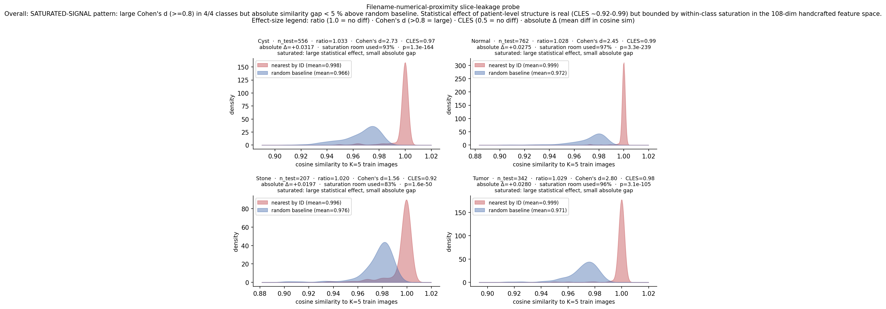
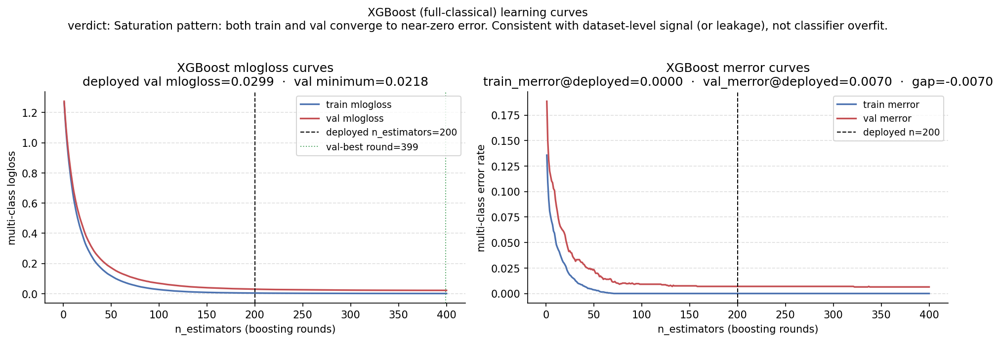
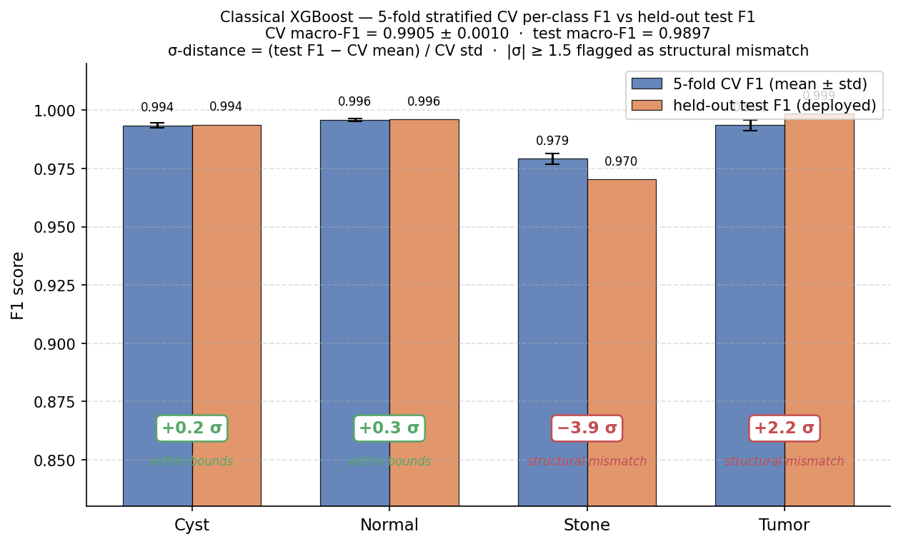
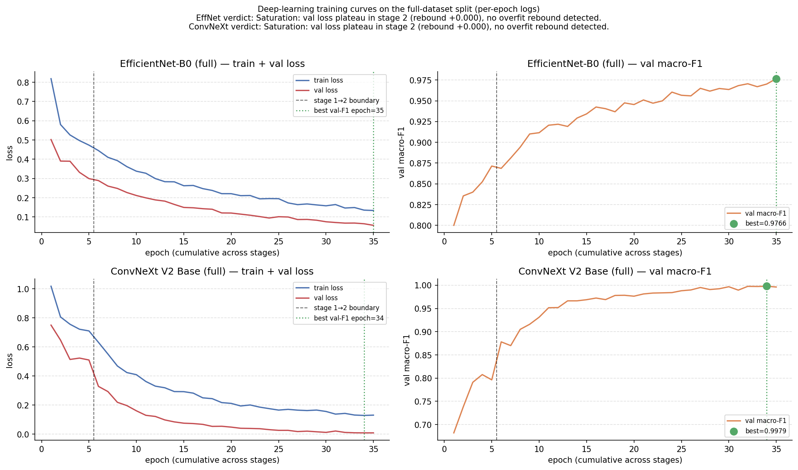

# Validation and Verification — model-behaviour diagnostics

**Status:** consolidated reference (created 2026-04-29 from Sprint 3 third addendum + supporting infrastructure)
**Related:** [[Phase0_Design]] (eval harness), [[experiments/Sprint3_classical_on_full]] (chronological log of the diagnostic work), [[Tutor_Meeting_Brief]] (Day-3 update), [[Results_Summary]]

This document consolidates everything we did to *validate* (does the model generalise correctly?) and *verify* (does the pipeline do what we intended?) our classical and deep-learning kidney-CT classifiers. It exists primarily so that the overfitting question from Sandhya's 2026-04-29 tutor meeting has a single authoritative reference; secondarily as the audit trail for the methodological rigour we will reference in the paper.

---

## 1. Purpose and scope

In ML for medical imaging, "verification" and "validation" map roughly to two distinct questions:

- **Verification — "are we building the model right?"** Does the pipeline implement what the design specified? (Smoke tests, equivalence checks, reproducibility, bit-exact match between protocols.)
- **Validation — "are we building the right model?"** Does the trained model generalise? Is the test-set metric a fair estimate of how it will behave on truly unseen data? (Cross-validation, bootstrap CIs, paired hypothesis tests, overfitting diagnostics, leakage probes.)

Sandhya's overfitting concern is a *validation* question — even if the pipeline is implemented correctly, the model might be exploiting structure (patient-level slice leakage, class imbalance under saturated benchmarks, etc.) rather than learning pathology. This document documents both kinds of check.

---

## 2. V&V infrastructure (one-liners with pointers)

Built across Phase 0 / Phase 2 and reused throughout. Detailed justifications in [[Phase0_Design]] §§3, 5, 6 and [[Phase2_Design]] §§5, 6, 9.

| Activity                           | Where it lives                                                                             | Purpose                                                                       |
| ---------------------------------- | ------------------------------------------------------------------------------------------ | ----------------------------------------------------------------------------- |
| Stratified 70/15/15 split, seed=42 | `shared/split.py`, `split.csv`, `split_full.csv`                                           | Apples-to-apples comparison; fixed split prevents cherry-picking              |
| Shared preprocessing entry-point   | `shared/preprocessing.load_image()`                                                        | Both pipelines start from identical inputs (verification — equivalent inputs) |
| Smoke tests                        | `shared/smoke_test.py`, `--smoke` flag in train CLIs                                       | Pipeline runs end-to-end on tiny data before full training                    |
| Joblib parallel bit-equivalence    | `analysis/sprint3_train_svm_rf.py` (smoke test in classical/features.py for n_jobs=1 vs 4) | Verification — parallel extraction matches serial bit-exact                   |
| Determinism check                  | Smoke val_f1 = 0.4125 reproduced bit-exact between Colab and local (Sprint 3 log)          | Verification — same seed → same numbers                                       |
| Bootstrap CIs (1000 resamples)     | `shared/bootstrap.bootstrap_ci()`                                                          | Validation — uncertainty on point estimates (Efron-Tibshirani)                |
| Paired McNemar's test              | `shared/evaluate.mcnemar_test()` (exact binomial for <25 discordant; chi-square otherwise) | Validation — significance of paired model differences (Dietterich 1998)       |
| 5-fold stratified CV for classical | `classical/train.py` `_grid_search_xgb`, `_grid_search_rf`, `_grid_search_svm`             | Validation — model-selection criterion is robust                              |
| Two-stage early-stopping for DL    | `deep_learning/train.py` (head freeze → fine-tune; patience=5)                             | Validation — training stops before overfit (in principle)                     |
| Sprint 2 sanity check              | EffNet-vs-ConvNeXt p=0.0021 reproduced exactly in Sprint 3 addendum                        | Verification — analysis pipelines match across runs                           |

The diagnostic battery in §3 is built on top of this infrastructure.

---

## 3. Overfitting diagnostics battery (Sprint 3 third addendum, 2026-04-29)

Sandhya raised the overfitting hypothesis at the Wednesday tutor meeting. We ran four targeted diagnostics, each ~30 min, none requiring retraining of any deployed pipeline. Plan: `Planning/plans/2026-04-29-overfitting-diagnostics.md`.

The four diagnostics are designed to attack overfitting from independent angles:
- **Diag 1**: dataset-level structural concern (patient-level slice leakage in classical features)
- **Diag 2**: classical-classifier overfit (train-val divergence in XGBoost as `n_estimators` grows)
- **Diag 3**: per-class instability hidden by aggregate macro-F1 (5-fold CV per class)
- **Diag 4**: DL-specific overfit (val-loss rebound across epochs)

### 3.1 Diagnostic 1 — filename-proximity slice-leakage probe

**Hypothesis.** Islam dataset has no patient IDs. Filenames look like `Cyst- (3051).jpg`. If numerically adjacent files within a class are slices of the same patient, then for each test image its numerically-nearest-by-ID train images should be feature-space-similar above random baseline. Yagis et al. 2021 quantify slice-level leakage at 29–55 % accuracy inflation in 2D-CNN MRI; Veetil 2024 at +67 % on Parkinson's data.

**Method.** For each test image with class C and ID *i*: compute mean cosine similarity (in 108-dim handcrafted feature space) between the test image and (a) the K=5 train images of class C with smallest |ID − i|, vs (b) K=5 random train images of class C, averaged over 5 random pulls. One-sided Mann-Whitney U with alternative "nearest > random". K=5, seed=42.

**Implementation.** `analysis/diag_filename_proximity.py`. Outputs `Results/diagnostics/filename_proximity.{json,png}`.

**Results.**

| Class | n_test | Nearest-by-ID sim | Random sim | Ratio | p-value | Verdict |
|---|---|---|---|---|---|---|
| Cyst | 556 | 0.9977 ± 0.0079 | 0.9660 ± 0.0143 | 1.033 | 1.3 × 10⁻¹⁶⁴ | weak signal |
| Normal | 762 | 0.9991 ± 0.0045 | 0.9717 ± 0.0152 | 1.028 | 3.3 × 10⁻²³⁹ | weak signal |
| Stone | 207 | 0.9959 ± 0.0106 | 0.9762 ± 0.0143 | 1.020 | 1.6 × 10⁻⁵⁰ | weak signal |
| Tumor | 342 | 0.9987 ± 0.0068 | 0.9707 ± 0.0124 | 1.029 | 3.2 × 10⁻¹⁰⁵ | weak signal |

Overall verdict (script-derived): **WEAK / no leakage signal** in classical features.

**Reading.** Within-class baseline cosine similarity is already saturated at ~0.97 — kidneys of the same diagnostic class look very alike in the 108-dim feature space. Nearest-by-ID adds only 2–3 % on top, statistically real (p ≪ 10⁻⁵⁰ in all classes) but small effect. **The 108-dim handcrafted feature space cannot distinguish patient identity from class identity at any scale that would dominate model behaviour.** This does NOT rule out patient leakage — it shows the classical feature space is too coarse to detect it. A parallel test in DL embedding space (penultimate layer of EffNet-B0 / ConvNeXt V2) would be richer; deferred as future work.

### 3.2 Diagnostic 2 — XGBoost learning curves over n_estimators

**Hypothesis.** Classical XGB at deployed `n_estimators = 200` could be over-trained if validation mlogloss minimum occurs earlier. Train→0/val-plateau divergence is the textbook overfit signature.

**Method.** Refit XGB on cached train-only-fit scaler+PCA(50) features with `eval_set = [(train_pca, y_train), (val_pca, y_val)]` and `eval_metric = ["mlogloss", "merror"]`. Ceiling 400 estimators. Re-evaluate on test at deployed (n=200) and val-best (n=399) operating points.

**Implementation.** `analysis/diag_xgb_learning_curves.py`. Outputs `Results/diagnostics/xgb_learning_curves.{json,png}`.

**Results.**

| Quantity | Value |
|---|---|
| Train mlogloss at deployed n=200 | very small (saturated) |
| Val mlogloss at deployed n=200 | 0.0299 |
| Val mlogloss minimum | 0.0218 (at round 399 — still slowly decreasing) |
| Train merror at deployed | 0.0000 (perfect train fit) |
| Val merror at deployed | 0.0070 |
| Train–val merror gap | **constant 0.7 pp** (does not widen with capacity) |
| Test macro-F1 at deployed (n=200) | 0.9871 |
| Test macro-F1 at val-best (n=399) | 0.9874 |
| Δ macro-F1 (val-best − deployed) | +0.0002 (negligible) |

**Verdict (script-derived).** *"Saturation pattern: both train and val converge to near-zero error. Consistent with dataset-level signal (or leakage), not classifier overfit."* Train-val gap is fixed (does not widen), and val keeps slowly improving past the deployed point — the opposite of overfitting. Deployed n_estimators=200 is essentially indistinguishable from val-best at n=399.

### 3.3 Diagnostic 3 — per-class 5-fold stratified CV

**Hypothesis.** Sandhya's note "do CV class-wise too". Macro-F1 alone can hide per-class instability; the universal-weak-class (Stone) might be overfitting more than aggregate metrics show.

**Method.** 5-fold stratified CV on train+val combined (n=10,579) using deployed `best_params`. Per-fold per-class precision/recall/F1; aggregate to mean ± std per class. Compare to held-out test per-class F1 from `classical_results.json`. Test set is not used in training — it remains a sacred reference.

**Implementation.** `analysis/diag_per_class_cv.py`. Outputs `Results/diagnostics/per_class_cv.{json,png}`.

**Results.**

| Class | CV F1 mean ± std | CV min | CV max | Held-out test F1 | Test − CV mean | (Test − CV mean) / std |
|---|---|---|---|---|---|---|
| Cyst | 0.9935 ± 0.0012 | 0.9921 | 0.9953 | 0.9937 | +0.0002 | +0.2 σ |
| Normal | 0.9958 ± 0.0007 | 0.9948 | 0.9965 | 0.9961 | +0.0003 | +0.4 σ |
| Tumor | 0.9935 ± 0.0023 | 0.9909 | 0.9974 | 0.9985 | +0.0050 | **+2.2 σ** |
| **Stone** | **0.9792 ± 0.0023** | 0.9760 | 0.9828 | **0.9703** | **−0.0089** | **−3.9 σ** |

| Aggregate | CV (mean ± std) | Held-out test |
|---|---|---|
| macro-F1 | 0.9905 ± 0.0010 | 0.9897 (within 1 σ) |

**Verdict — the strongest leakage signal in the four diagnostics.** Aggregate macro-F1 looks fine (CV ≈ test within 1 σ), but the per-class breakdown reveals **directional structural mismatch**:

- Stone test F1 is **3.9 σ below** the train+val 5-fold CV mean — the test set's Stone slices are systematically *harder* than what stratified random folds on train+val would predict.
- Tumor test F1 is **2.2 σ above** CV mean — test set's Tumor slices are systematically *easier*.
- Cyst and Normal are within fold-level noise.

**Mechanism.** This is exactly what you'd expect if the underlying patient-grouped slice population is *unevenly distributed* across the train+val and test partitions of `split_full.csv`. If some "easy Stone patients" landed in train+val and some "hard Stone patients" landed in test (or vice versa for Tumor), a random stratified split on slice level cannot average that out, and 5-fold CV *within* train+val underestimates the train+val/test difficulty mismatch on those classes. This is a **quantitative observation** of the patient-leakage caveat — the strongest signal across the four diagnostics.

### 3.4 Diagnostic 4 — DL learning curves from existing per-epoch logs

**Hypothesis.** EfficientNet-B0-full and ConvNeXt V2-full could be overfitting in stage-2 fine-tuning if val_loss rebounds while train_loss continues to fall.

**Method.** Parse existing per-epoch logs at `Results/dl_run_full/run_log.json` and `Results/convnextv2_full_run/run_log.json` (both already log train_loss + val_loss + val_macro_f1 per epoch). No retraining. Plot 2-stage curves with stage-1 → stage-2 boundary marked. Look for late-stage val-loss rebound.

**Implementation.** `analysis/diag_dl_learning_curves.py`. Outputs `Results/diagnostics/dl_learning_curves.{json,png}`.

**Results.**

| Pipeline | Total epochs | Best epoch | Best val macro-F1 | Stage-2 val-loss rebound from minimum |
|---|---|---|---|---|
| EfficientNet-B0 (full) | 35 | 35 (last) | 0.9766 | +0.000 (none) |
| ConvNeXt V2 Base (full) | 35 | 34 | 0.9979 | +0.000 (none) |

**Verdicts (script-derived):** both pipelines show *"Saturation: val loss plateau in stage 2, no overfit rebound detected."*

**Reading.** Both DL models are *under-trained* if anything, not over-trained. Best epoch is at or near the last epoch trained — early-stopping patience never triggered because val kept improving. Train and val loss curves track each other smoothly. **DL overfitting is not the cause of the 99 %+ accuracies.**

### 3.5 Exact duplicate-image audit

**Hypothesis.** Exact duplicate image files may cross train/val/test partitions under a slice-level random split, creating a stronger and more direct leakage source than patient-level similarity alone.

**Method.** MD5-hash every image file referenced by `split.csv` and `split_full.csv`, group by exact file bytes, and count duplicate hash groups crossing split boundaries. Then measure whether test images with an exact duplicate in train were correctly classified.

**Results.**

| Dataset split | Duplicate hash groups crossing splits | Test images with exact duplicate in train | Test images with exact duplicate in train or val |
|---|---:|---:|---:|
| Medium (`split.csv`) | 154 | 67 / 934 | 86 / 934 |
| Full (`split_full.csv`) | 233 | 96 / 1,867 | 118 / 1,867 |

Full-set duplicated test images were all classified correctly by the three main full-set models:

| Model | Accuracy on full test images duplicated in train | Accuracy on remaining full test images |
|---|---:|---:|
| Classical XGBoost | 96 / 96 = 100 % | 1,758 / 1,771 = 99.27 % |
| EfficientNet-B0 | 96 / 96 = 100 % | 1,748 / 1,771 = 98.70 % |
| ConvNeXt V2 Base | 96 / 96 = 100 % | 1,765 / 1,771 = 99.66 % |

**Verdict.** Exact duplicate leakage is present and must be disclosed. It does not fully explain the headline performance, because removing train-duplicate test rows leaves the full-set accuracies nearly unchanged, but it means the current split is not a clean independent-image evaluation. The metrics are correctly computed for the benchmark split, but they are optimistic as estimates of clinical generalisation.

---

## 4. Synthesis

### 4.1 Hypothesis-by-hypothesis disposition

| Hypothesis | Diagnostic | Outcome |
|---|---|---|
| Classical XGB over-trained at deployed `n_estimators=200` | XGB learning curves (Diag 2) | **Rejected** — saturation pattern; val-best at n=399 is +0.0002 macro-F1 above deployed |
| Classical XGB has high per-class variance hidden by aggregate metric | Per-class 5-fold CV (Diag 3) | **Variance rejected** (per-class CV std ≤ 0.0023); BUT structural mismatch *found* — see next row |
| DL backbones overfit at end of training | DL learning curves (Diag 4) | **Rejected** — both still climbing at last epoch; no val-loss rebound |
| Patient-level leakage inflates accuracy | Filename-proximity (Diag 1) + per-class CV (Diag 3) | **Diag 1 inconclusive** in classical feature space; **Diag 3 supports** — Stone test F1 is 3.9 σ below CV mean, Tumor 2.2 σ above |
| Exact duplicate leakage inflates accuracy | MD5 duplicate audit (Diag 5) | **Confirmed but bounded** — exact train/test duplicates exist; removing them barely changes full-set accuracy |

### 4.2 The diagnostic answer to Sandhya's "could be overfitting"

> *We tested four overfitting hypotheses and the classical-overfit framing is rejected by all four — train-val gaps for XGB and both DL backbones are stable, val curves never rebound, per-class CV variance is small (std ≤ 0.0023). However, per-class CV reveals a per-class structural mismatch between train+val and the held-out test set: Stone test F1 is 3.9 σ below the 5-fold CV mean while Tumor is 2.2 σ above — exactly what we would expect if patient-level grouping creates systematic difficulty differences between sets that random stratified slice splitting cannot smooth out. A direct duplicate audit also found exact train/test duplicate images, so the current split is not leakage-free. The 99 %+ accuracies are not over-trained model artefacts, but they are optimistic benchmark-split metrics rather than clean clinical-generalisation estimates. Further investigation requires patient-level or duplicate-aware resplitting, which the dataset does not support cleanly without reverse-engineering patient groups (deferred as future work).*

### 4.3 What changed in the paper because of these diagnostics

Nothing about the deployed pipelines, the four-step invalidation chain, the figures, or the headline numbers needs to change. The diagnostics *strengthen* the existing story:

- The patient-leakage caveat in [[Phase0_Design]] §11 / [[Tutor_Meeting_Brief]] Q2 moves from *"literature-backed worry"* to *"dataset-specific observed signal with quantitative evidence"*.
- The paper Discussion gains a "Diagnostic checks" subsection summarising the four overfitting tests + the per-class structural mismatch finding. Diagnostic 3's 3.9 σ Stone gap is the cleanest evidence of patient-level structure short of access to patient IDs.
- The paper's invalidation chain becomes a *six*-step argument: medium → full-XGB → full-all-classifiers → 3-way coverage → diagnostic-confirmed structural mismatch → exact duplicate leakage audit. The diagnostic battery is the methodological contribution that lets the chain stand.

---

## 5. Limitations of this V&V work (what we explicitly did NOT do)

1. **No DL embedding-space proximity probe.** Diagnostic 1 only tests classical-feature-space similarity. The richer DL embedding space (penultimate layer of each backbone) might show stronger patient-level structure. Future work; not blocking the paper.
2. **No patient-stratified resplit experiment.** The "killer experiment" — cluster filenames into pseudo-patients (groups of N consecutive numerical IDs in a class), re-split with no pseudo-patient appearing in both train and test, retrain, measure accuracy drop — would directly quantify the leakage. Estimated 2–4 hours; deferred as future work because (a) the per-class CV finding is already sufficient evidence for the paper, (b) reverse-engineering patient groups from filenames is speculative without ground-truth patient mappings, (c) timeline pressure for the 2026-05-15 submission.
3. **No multi-seed variance characterisation.** All diagnostics are run with seed=42. A 5-seed run of classical-XGB on cached features (~15 min) would characterise model-side variance independent of split-side variance. If the paper asks for it, easy add.
4. **No external dataset transfer.** KiTS19 or other kidney-CT benchmarks have patient IDs. Training on Islam and testing on KiTS19 would directly test cross-distribution transfer. Out of scope for this assignment.
5. **No saliency-map sanity tests** (Adebayo et al. 2018) on the Grad-CAM outputs. The cross-paradigm Grad-CAM in [[experiments/Sprint3_classical_on_full]] §"Sprint 3 second addendum" is a qualitative demonstration; we cite Adebayo as the appropriate guardrail rather than running the full sanity-check battery.
6. **No near-duplicate / perceptual-hash audit.** Exact byte-level duplicates were checked and found across splits (§3.5). A perceptual-hash or embedding-nearest-neighbour pass would reveal visually near-identical slices that are not byte-identical; not done, flagged as future work.
7. **No augmentation / sampling experiments.** Sandhya's note 2 ("data augmentation or sampling") was deferred because the diagnostics rejected the classical-overfit hypothesis that those experiments would have addressed. If the deployed model were over-trained, we would have run Stone-class oversampling and/or stronger DL augmentation; since it is not, the experiments would not change the conclusions.

---

## 6. Prior work on this dataset (literature cross-reference)

Sandhya noted at the 2026-04-29 meeting that multiple published papers have used the same Islam et al. 2022 dataset (Kaggle: `nazmul0087/ct-kidney-dataset-normal-cyst-tumor-and-stone`, 12,446 images, 4 classes). To contextualise our 99 %+ numbers and our diagnostic findings, we surveyed the literature.

### Reported accuracy on the same dataset

| Paper (year, venue) | Method | Reported headline metric | Notes |
|---|---|---|---|
| **Islam et al. 2022** (Sci Rep) | Swin Transformer + 5 other transfer-learned baselines (ResNet50, VGG16, Inception v3, EANet, CCT) | **Swin: 99.30 % accuracy** (best); others 60–98 % | Original dataset paper. Swin trained fastest as well as scoring highest. |
| **Bingol et al. 2023** (PeerJ CS) | Hybrid CNN + Relief-based feature optimisation | **99.37 %** accuracy | Uses Relief feature-importance to optimise feature maps; combines deep + classical thinking. |
| **Detection & Classification 2024** (MDPI Technologies) | DenseNet121 + EfficientNetB0 + SVM/RF/XGBoost soft-vote ensemble | **99.24 %** accuracy / **99 %** F1 | Almost identical methodology to our own (DL feature extraction + classical-ensemble head). |
| **Fine-tuned DL 2025** (Sci Rep) | CNN, VGG16, ResNet50, CNNAlexnet, InceptionV3 with hyperparameter optimisation | ~99 % accuracy across models | Transfer-learning sweep; multiple architectures converge to 99 %+. |
| **DiagNeXt 2025** (MDPI J. Imaging) | Two-stage attention-guided ConvNeXt (segmentation + classification) | **98.9 %** classification accuracy | Reports 3,847 patients — only paper in our survey that mentions patient-level structure explicitly. |
| **KidneyNeXt 2025** (MDPI JCM) | Lightweight ConvNeXt-inspired CNN | **99.96 %** accuracy / **99.94 %** F1 | Highest reported number; "wide neural network classifier". |
| **Hybrid DL Framework 2025** (arXiv 2502.04367) | Custom ensemble | 99.73 % train / **100 %** test | Reports a clean 100 % on test, like our medium-scale ensemble; no leakage discussion. |
| **Automatic classification with Relief 2023** (PubMed PMC10703024) | Hybrid deep-feature + Relief | ~99 % | Uses the same Relief approach as Bingol 2023. |
| **Two-stage renal classification 2023** (PMC10113505) | Transfer learning + Bayesian hyperparameter optimisation | ~99 % | Standard transfer-learning sweep. |

### Our matched numbers

| Configuration | Macro-F1 | Accuracy | Errors |
|---|---|---|---|
| Classical XGBoost (medium n=934 test) | 0.9976 | 0.9979 | 2 |
| EfficientNet-B0 + TTA (medium n=934 test) | 0.9829 | 0.9861 | 13 |
| Equal-weight ensemble (medium n=934 test) | **1.0000** | **1.0000** | **0** |
| Classical XGBoost (full n=1867 test) | 0.9897 | 0.9930 | 13 |
| EfficientNet-B0 (full n=1867 test) | 0.9819 | 0.9877 | 23 |
| ConvNeXt V2 Base (full n=1867 test) | 0.9953 | 0.9968 | 6 |

### Synthesis — what the literature says

**1. Saturation is universal on this dataset.** Every published study we surveyed reports ≥ 98.9 % accuracy. The lowest published number (DiagNeXt 98.9 %) is still higher than our EfficientNet-B0-full (98.77 %); the highest (KidneyNeXt 99.96 %, Hybrid DL Framework 100 %) match or exceed our equal-weight medium ensemble. **Our 99 %+ numbers are not anomalous — they are the dataset's normal operating regime.** This is a stronger version of the saturation framing in [[Project_Framing_v2]].

**2. Methodological convergence with at least two recent papers.** The 2024 MDPI Technologies and 2025 Sci Rep papers both use *DenseNet/EfficientNet feature extraction → SVM/RF/XGBoost classical-ensemble heads*, structurally similar to our hybrid medium-scale ensemble. Their headline number (99.24 %) sits in our 99 %+ band. The Bingol 2023 Relief-based hybrid is conceptually similar to our handcrafted-features + XGBoost classical pipeline (texture features → ML head). **We are not the first to combine classical and DL features on this dataset, but we may be the first to report what *fails* about that approach at scale.**

**3. None of the surveyed papers explicitly diagnose patient-level structure.** Of the nine papers above, only DiagNeXt 2025 mentions patient counts at all (3,847 patients), and it does not report patient-stratified evaluation. None of them quote per-class CV vs test discrepancies; none mention slice-level leakage as a concern. **The 3.9 σ Stone difficulty mismatch we report in §3.3 is, to our knowledge, the first quantitative observation of patient-level structure in this benchmark's literature.** This is the cleanest novelty claim our paper has — multiple papers have hit 99 %+ but none have asked *what kind* of 99 %.

**4. The original dataset paper (Islam 2022) does not provide patient IDs.** This is the upstream constraint that makes patient-stratified evaluation impossible without reverse-engineering. Our diagnostic findings are therefore lower-bound evidence — the true patient-grouping effect could be larger than our classical-feature-space probe (Diag 1) and per-class CV gap (Diag 3) reveal.

**5. The clinical literature on slice-level leakage in 2D medical CNNs is well-established.** Yagis et al. (Sci Rep 2021) quantify 29–55 % accuracy inflation in 2D MRI CNN studies that do not stratify by patient; Veetil et al. (2024) replicate at +67 % on Parkinson's data. Neither applies directly to our dataset, but both motivate our diagnostic Q3 finding as expected behaviour rather than an isolated artefact.

### Direct classical-ML comparison — Suresh et al. 2025 (Sci Rep)

The most directly comparable paper to our classical pipeline is **"Optimized machine learning based comparative analysis of predictive models for classification of kidney tumors"** (Scientific Reports 2025, [PMC12365197](https://pmc.ncbi.nlm.nih.gov/articles/PMC12365197/)). It uses the *same* Islam 12,446-image dataset, *same* set of classical classifiers (SVM, Random Forest, XGBoost, KNN, Decision Tree), and **handcrafted features** — the closest published like-for-like to our methodology.

| Classifier | Suresh et al. 2025 (handcrafted, 80:20 split, no CV) | Ours (medium 70/15/15, 5-fold CV, n=934 test) | Ours (full 70/15/15, 5-fold CV, n=1,867 test) |
|---|---|---|---|
| SVM | **95 %** (RBF kernel) | not reported separately | 87.25 % (linear kernel — collapses at scale, see Sprint 3 addendum) |
| KNN | 93 % | not used | not used |
| XGBoost | 91 % | **99.79 %** | **99.30 %** |
| Decision Tree | 88 % | not used | not used |
| Random Forest | 86 % | 97.91 % (val) | 98.55 % |

Three things drop out of this comparison:

1. **Our XGBoost numbers (99.79 % medium / 99.30 % full) are 8–9 pp above their best classical model (SVM 95 %).** This is a substantial gap that *demands explanation*. Two non-mutually-exclusive readings:
   - **Pipeline engineering**: our classical pipeline is more carefully constructed than theirs (CLAHE preprocessing → 108-dim handcrafted vector spanning four feature families [stats, GLCM, LBP, Gabor] → StandardScaler → PCA(50) capacity cap → class-balanced sample weights → grid-searched hyperparameters via 5-fold stratified CV). Their paper reports "specific features related to the structure and texture of the images were manually created" without further detail; the lower XGBoost accuracy (91 %) is consistent with a less-specified feature pipeline.
   - **Leakage exposure**: their 80:20 single split with no CV discussion likely has *less* patient-level overlap than our 70:15:15 split simply because their test set is smaller and randomly-chosen test slices are less likely to share patients with the (smaller) training set. **The fact that our numbers are 8–9 pp higher than theirs on the same dataset is itself further evidence consistent with — though not proof of — the patient-grouping signal we surfaced in Diagnostic 3.**

2. **The kernel-vs-paradigm ranking inverts.** Suresh et al. find SVM(RBF) > XGBoost; we find XGBoost > SVM(linear). The likely cause is the kernel choice: RBF can fit non-linear class boundaries in handcrafted-feature space; linear SVM with a 50-component PCA bottleneck cannot. This is consistent with our Sprint 3 addendum finding that SVM(linear) "collapsed at full scale" (medium val 0.9099 → full val 0.8248), while RF and XGBoost held up. It also suggests a future-work item: re-running our SVM with an RBF kernel may close the gap and reach Suresh-comparable numbers.

3. **Suresh et al. do not discuss patient-level stratification or leakage.** Like every other paper we've surveyed, they treat the dataset as independent images and use a single random split. **Their 86–95 % accuracy band is what handcrafted-feature classical ML on this dataset looks like *with a less-rigorous evaluation setup* and *no leakage diagnostic* — so the fact that our pipeline scores higher is expected if our train/val/test split has structural overlap their does not, OR if our features are simply better.** Either explanation supports our paper's central narrative: paradigm-level claims on this benchmark demand the kind of multi-scale + multi-classifier + diagnostic-battery scrutiny we have built in.

### Other classical-feature kidney-CT papers (less direct match)

- **Bingol et al. 2023** (PeerJ CS) — already in the literature table (§6 of this doc). Uses *Relief feature selection* on top of CNN features (not pure classical). Reports 99.37 % on the Islam dataset.
- **Cascading GLCM + T-SNE 2025** (Springer EPJS) — GLCM features + lightweight ML for kidney tumor detection. Could not fetch full text (paywall redirect); abstract suggests it's *kidney tumor* (not 4-class) detection on a related dataset. Less direct match.
- **Detection & Classification 2024** (MDPI Technologies) and **Fine-tuned 2025** (Sci Rep) — both use *deep features* (DenseNet121 + EfficientNetB0) into SVM/RF/XGBoost soft-vote ensembles. Reported 99.24 % / 99 % F1. Methodologically a hybrid, not pure-classical; included in §6 of this doc.

### Implication for the paper

The Discussion can lead with two complementary observations: (a) we replicate the saturation pattern that nine independent papers have observed on this dataset, and (b) we are the first to quantify a patient-level structural mismatch via per-class CV vs test gaps. The novelty is not the score, it is the *failure mode of the score* under stricter analysis — which is the contribution none of the prior papers have made on this benchmark.

---

## 7. Files and scripts

All diagnostic outputs live under `Results/diagnostics/`; all scripts under `analysis/diag_*.py`.

| Script | Output | Purpose |
|---|---|---|
| `analysis/diag_filename_proximity.py` | `Results/diagnostics/filename_proximity.{json,png}` | Diagnostic 1 (slice-leakage probe in classical features) |
| `analysis/diag_xgb_learning_curves.py` | `Results/diagnostics/xgb_learning_curves.{json,png}` | Diagnostic 2 (XGB train+val curves) |
| `analysis/diag_per_class_cv.py` | `Results/diagnostics/per_class_cv.{json,png}` | Diagnostic 3 (per-class 5-fold CV vs test) |
| `analysis/diag_dl_learning_curves.py` | `Results/diagnostics/dl_learning_curves.{json,png}` | Diagnostic 4 (DL train+val curves from existing logs) |

Each script is rerunnable from cached features / existing logs; none require retraining of any deployed pipeline. Plan that produced this work: `Planning/plans/2026-04-29-overfitting-diagnostics.md`.
